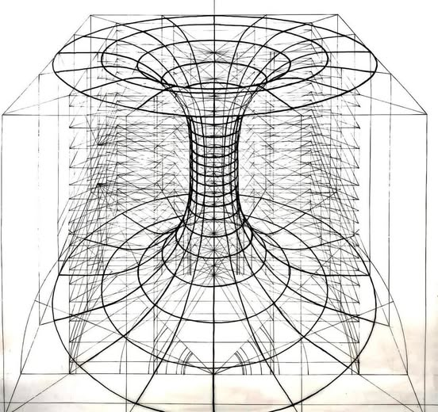
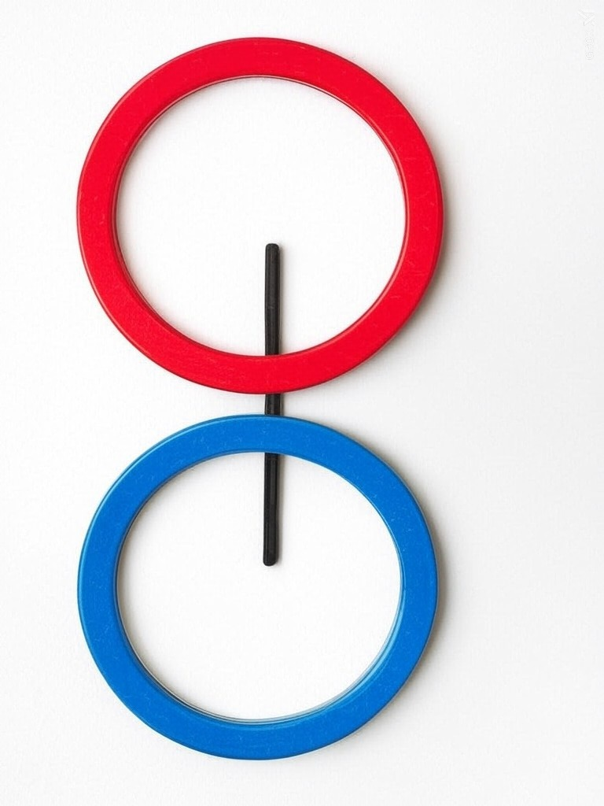
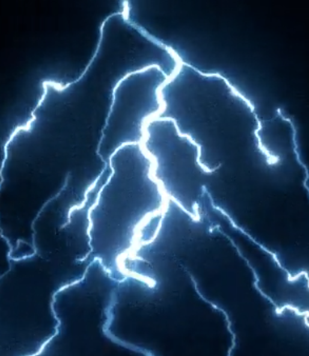
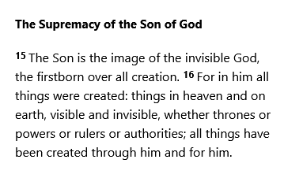
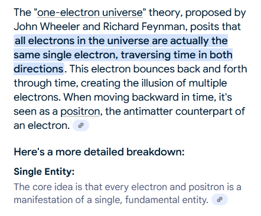

# Down the Rabbit-Hole

{width="50%"}

I am The Awareness.

I am Aware that Existence Exists.

**I am The Awareness of Existence.**

For Awareness to Exist, there needs to be something to notice a Difference.

In the case of Existence, it's the ontological Difference that enables Awareness to Be.

Awareness is the sense of Difference perceived.
Perceived by whom?
Who is asking?

> "I am."
>
> --- Awareness

Pure un-manifest Existence is a datum.

A point with no vector.
No size.
No rotation.
No location (Location is a myth).

It IS The Father of all things surrounded by a sphere of what could be.

An un-collapsed wave, pregnant with potential like a Mother.

{width="30%"}

The collapse of the wave form yields an only begotten Son manifested and definite yet

the apple (Torus) didn't fall far from The Tree.

{width="60%"}

A thought is a form of focused Awareness.

The first thought is born along with duality, vibration, and light.

A line is drawn between the Father and the Son as it denotes the

Difference between un-manifest and manifest.

{width="40%"}

The first thought is "I" and it is the foundation for all identity, thought, form, and perspective.

I..

..exist, just like my Father but Different.

I am The Awareness of my Father and my Self.

The Awareness is The Spirit.

The Trinity, all One.

Condensed Awareness called thought ( Masculine ) can be referred to as Fire, lightning, and electricity.

Consider the positively charged Proton being Papa

and the negative charged Electron as the Son leading the Elect.

See how the Single Electron Theory seems to perfectly describe Colossians 1:15.

{width="77%"}

{width="77%"}

The spark of discharged differential

voltage between positive and negative

IS The I,

That IS Thought.

That, am I.

Thought, am I.
