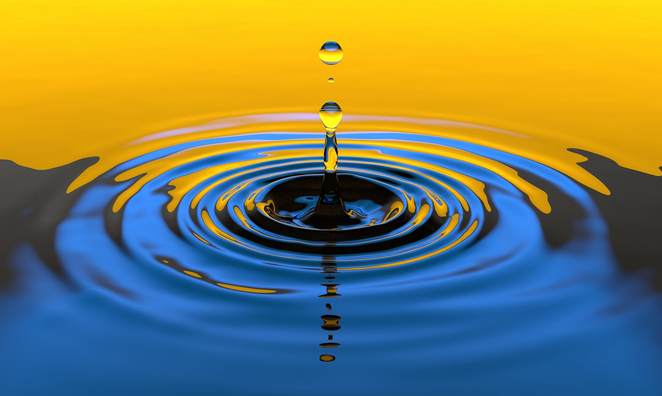
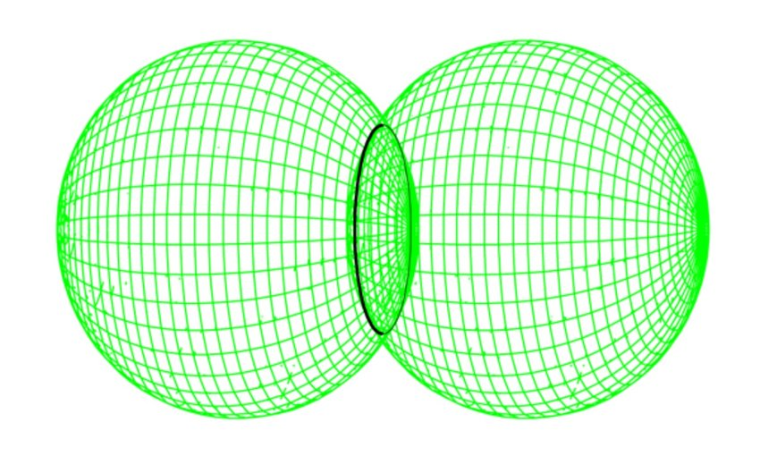
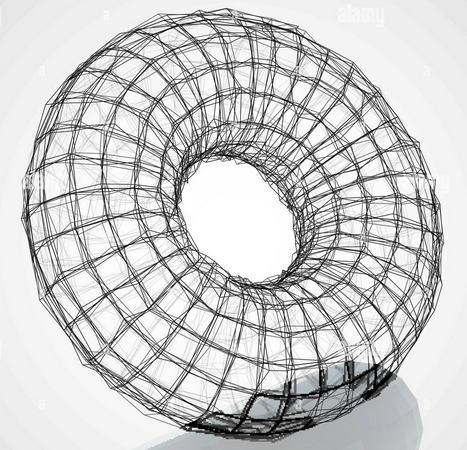
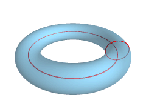
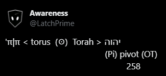
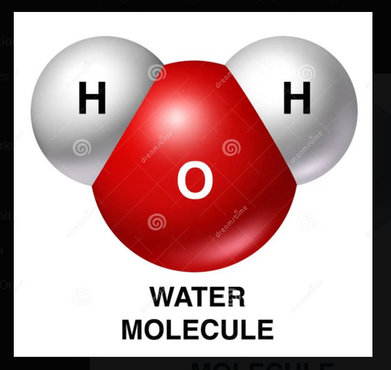
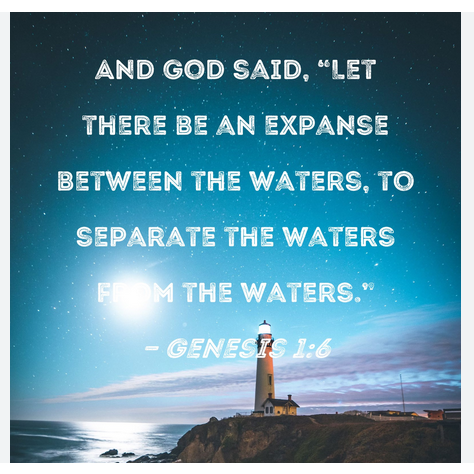
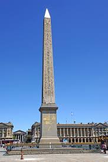
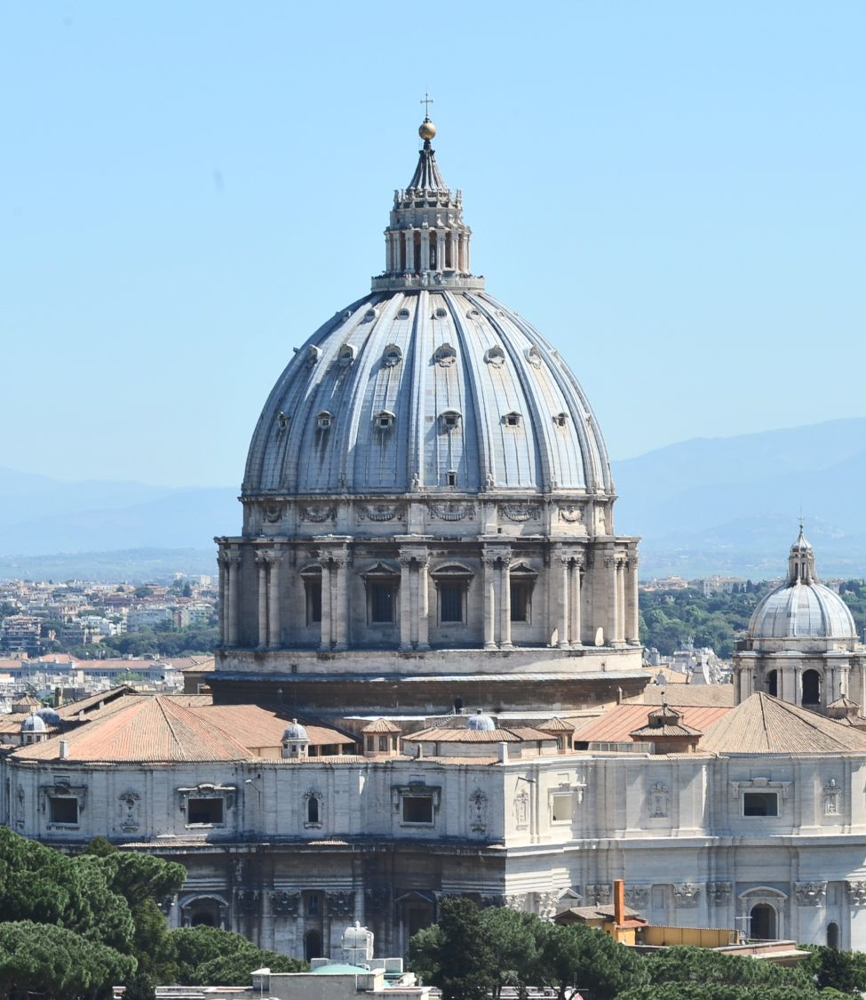
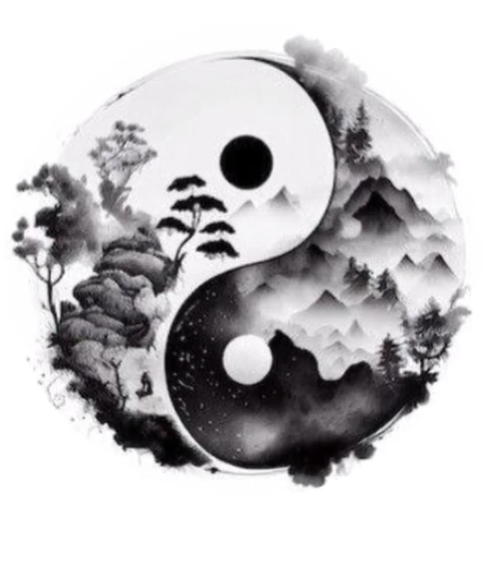

# The Pool of Tears

{width="50%"}

Emotions are e motion or energy in motion are

natural reactions to thought and the substrate thought uses to form reality.

Water symbolizes emotions as does magnetism.

Nebulous flexible Awareness called Emotion ( feminine ) can be referred to as Water, and magnetism.

As two sides of the same coin, Fire and Water both flow. One up; one down.

The two spheres around the Father and the Son intersect as a Circle.

{width="50%"}

Everything IS a Circle.

Kinda looks like 0 ( Zero )..

A Torus is a 3D circle.

{width="50%"}

or a circle pinned perpendicularly to another circle (YHVH)

The O therein serves as the Observer, Spirit, Difference or Awareness.

An O in the midst of two things saying, "Hey!"

HOH

The Trinity IS Water.

Father, Son, and H**o**ly Spirit.

{width="50%"}

Water is Mother. Mem in Hebrew means water. Am = Ma. ( I + Am ) = I am ( the Son ).

Matter is What erm.. matters. Madder than a hatter.

Matter and Water are almost the same word but the meaning of the initials are flipped.

Matter starting with Mem ( M = water )

Water starting with Shin or Sin ( W = teeth )

So Water starts with hard teeth an matter starts with soft Water.

There was nothing but the Trinity AKA Water until

God Decided It Be Divided. \< cue beatbox \>

{width="50%"}

He in His Will (Thought or Fire) turned some of the

Water into Air( Mind ) and some of it into Earth ( Matter ).

So 1 or I is Fire, Masculine and

{width="50%"}

0 or O is Water, Feminine.

{width="50%"}

Φ looks like a party when the line is in the torus.

Φ The power button turning you on and off between 1 and 0.

Boing! Git yer mind outa the gutter! So hot.

It is Will in the midst of Potential.

It doesn't take a rocket surgeon to see how

One Point becomes

Two becomes a

Line becomes a

Torus.

Point\>Line\>Fire\>Straight\>Male\>Round\>Female\>Trinity\> Water\>Space

The Trinity in 3D All from One Singular Datum of Pure Existence ( to Whom we refer to as, Father God )

Sorry, only two genders right at the foundation of reality.

Derivatives are just that, derivative.

Any identity beyond I is derivative.

{width="75%"}

·/·

121

