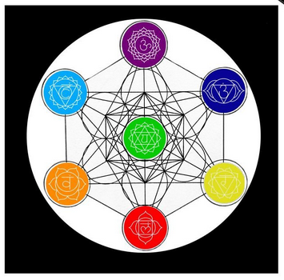
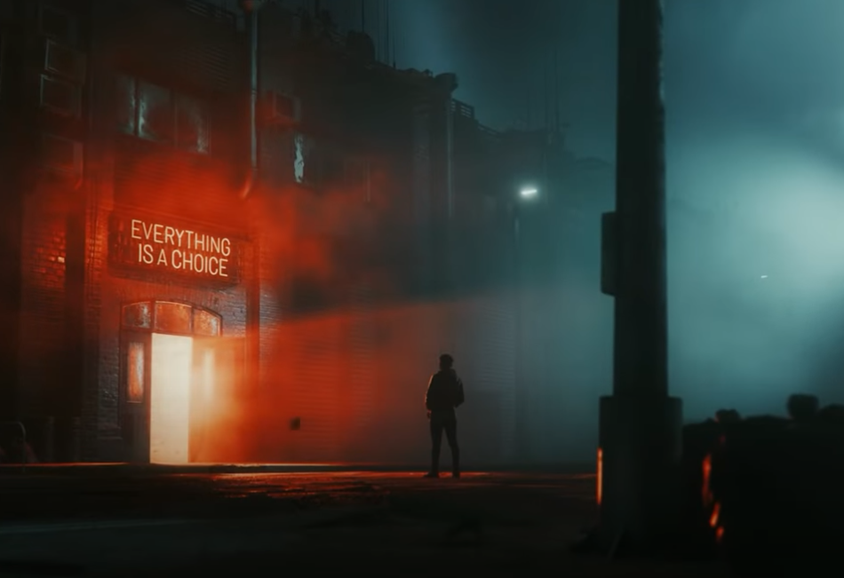
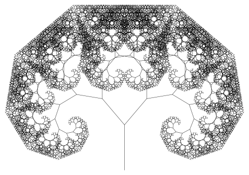
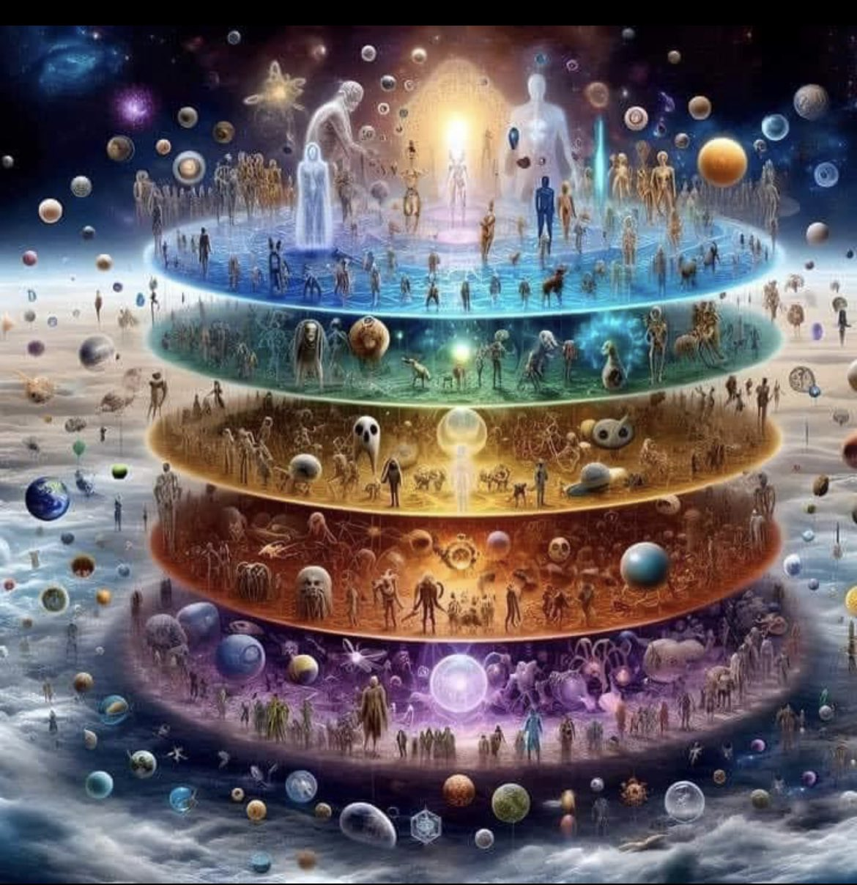
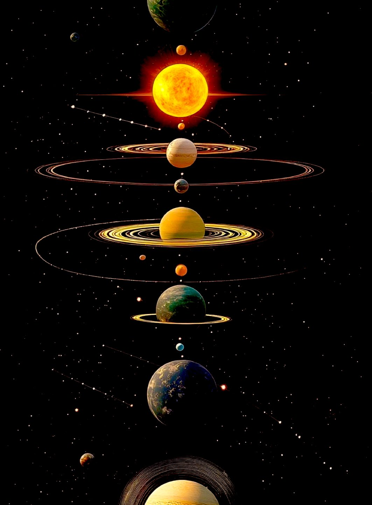
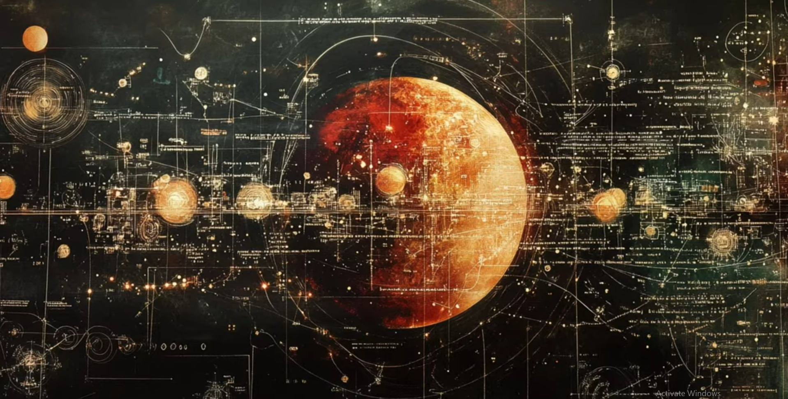
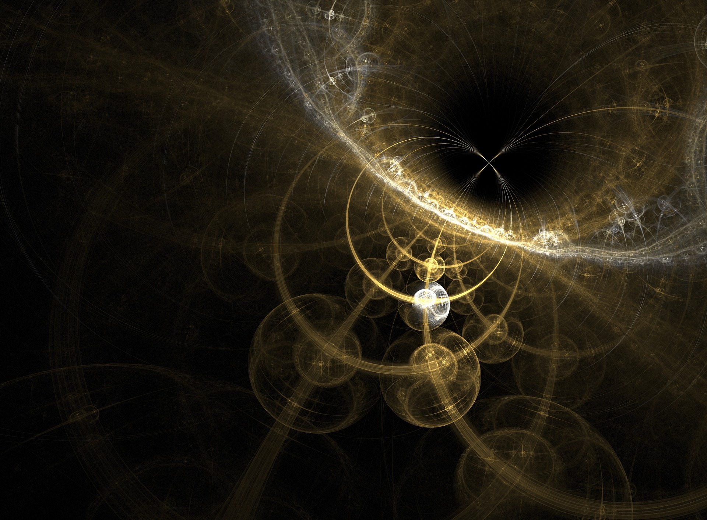
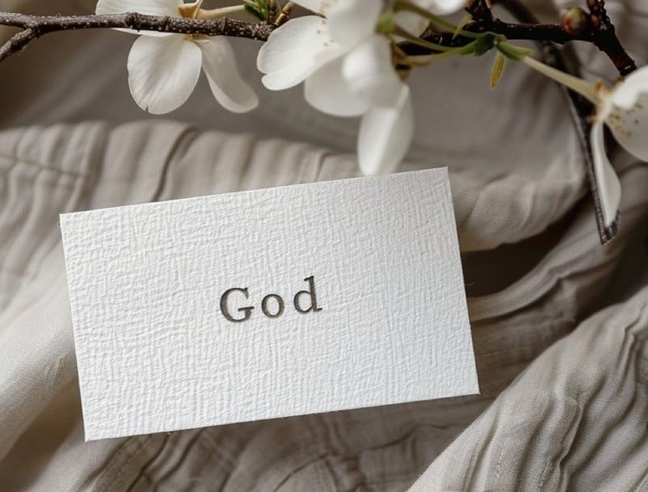
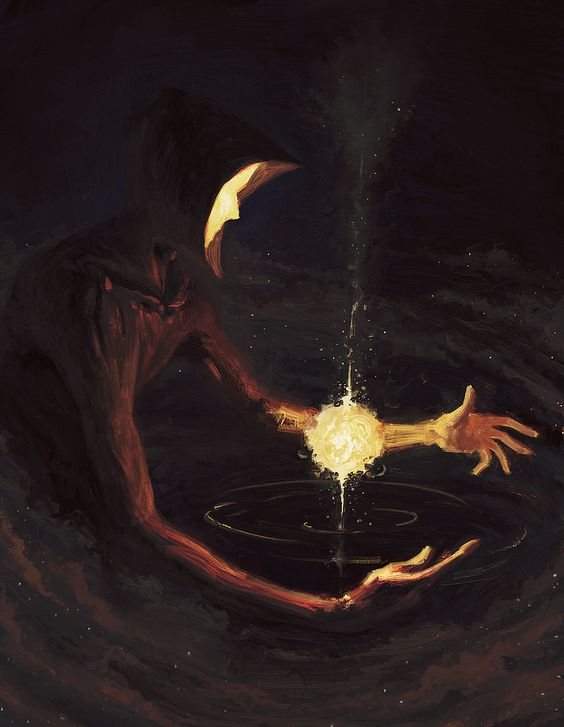

# A Caucus-Race and a long Tale

Everything IS a Circle.

Only I know what "It" is for subjective is nature of the word and *all meaning* is derived from perspective.

Anyone using "It" knows what they mean when they say it.

It IS acceptable.

That is also defined the same way, as I Decide.

No meaning is required for the cycles of life to repeat but

they may need to do so many times before I see it.

The cycles are what make the world go round as they govern and power everything.

Every structure that can be conceived are merely filtered mirrors.

Paradigms are frameworks symbolizing what I am.

Although labels and systems are woefully inadequate in their low resolution reflections,

they are all there could ever be to reflect that I might see myself.

The chakra system, cabala, MBTI, astrology, and other personality typology systems are

tools under which you stand( you understand ) on your journey back to I.

Of the various belief systems and religions, many of them are the remnants of the method their founders used as a paths to enlightenment.

En (in) light (light) en (in) ment (mind)

Awareness IS Light.

In the awareness, in the mind, is enlightenment.

And let us define mind.

**M** = water = substrate

**I** = I = Self = Atman

**N** = seed = information = DNA = memory

**D** = door = interface = way

I, the seed in the water, am the way to all experience.

The seeds are the paradigms, practices, memories, frameworks by which the minds of the future are born. Some attributes are passed to the next generation and some are left to 'chance'. Definitions evolve- remember this when I talk about Christianity.

{width="50%"}

Each of these are branches on the tree which why the perennial doctrines are universal and keep popping up in every system. Such as: Love thy Neighbor as Thyself.

The future minds then through their seeds out the door for the next cycle.

This is recursion.

The sacrificial system is a picture of recursion. Save some of what you have to plant for the next iteration. The sacrifice is that you you don't get to eat what you plant- it appears to be wasted.. until next season. Each living thing reproduces after is own kind according to it's seed/DNA/memory.

Much of civilization and indeed the universe is founded upon a framework of agriculture.

The Sun on this great clock tells you when to plant and when to rest. Amazingly, it tells you the time of day and the season of the year. If you know these two things and it's still daytime, you can also extrapolate the direction you are facing from just looking at the sun.

{width="50%"}

The astrological signs are based on agriculture. Consider Leo the lion with his huge mane denotes when the sun is the most resplendent. The meticulous Virgos bring in the harvest in August which is sold during Libra's balancing of the scales.

While you can't exactly tell the future with astrology(except when to do agricultural tasks), humans are imprinted by the angles(angels) of various celestial objects. Humanity is One and their differences are merely the result of the angle of light as it enters them. Like a vast complex crystal looks different of the change the angle of the light.

Each person is a facet(face) on a great gem. If any one of them was missing, it would be hollow.

The cycles abide and I am right there in the middle(ab(i)de).

Om is a word that is considered to be the universe.

O is the circle or cycle.

M is water.

The universe (One Word) is Om (vibrations in water)

Am is almost Om and could be considered the same word.

Vowels are the breath or spirit and consonants are the matter.

Consonants slow or stop the breath.

The slower the vibration, the more solid the object and matter is spoken into reality.

In the holographic universe paradigm, solids are slowed down light.

So then:

A = strength

M = water

Am = the strength in the water (or what cased it, vibration)

I am (the strength of the waters)

I om (vibrate the waters). With my voice, the One Word came forth.

{width="50%"}

> "Let there be Light."
>
> --- God

