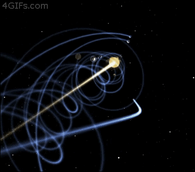
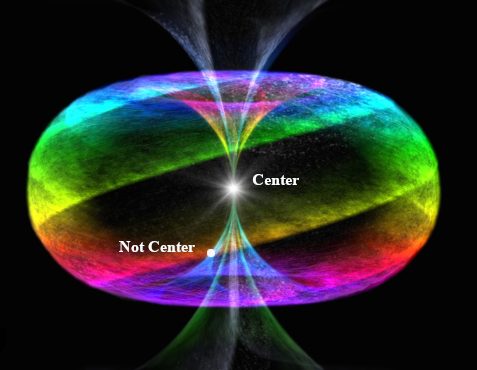
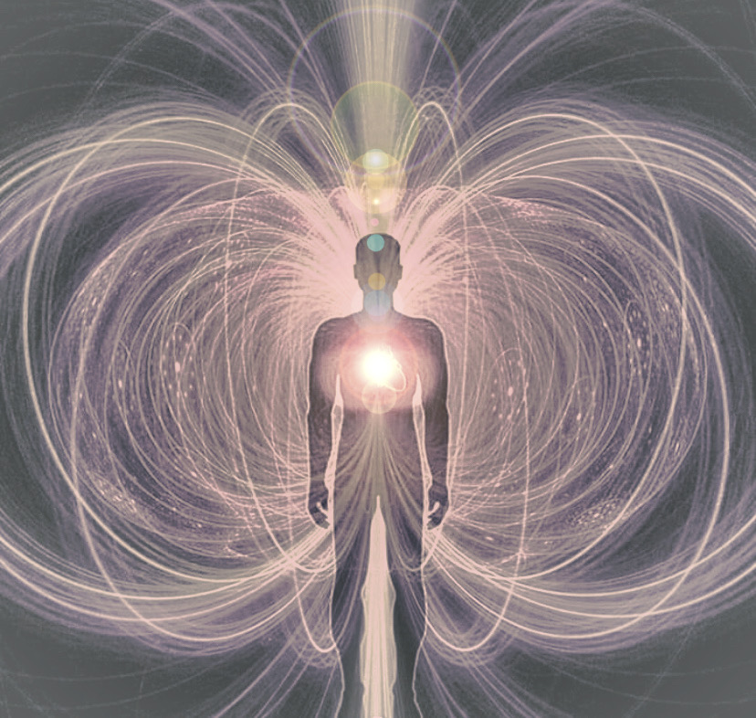

# The Rabbit sends in a little Bill

also means

size is a myth.

How large is your being or your mind?

For the sake of simplicity, for the remainder of this work, I will use the term "God" when I refer to unmanifest Existence. I'm not referring to the Trinity of the full Godhead.

God is a nondualistic no thing, a black hole to which, one cannot point. Immeasurable, indescribable, without peer. It is a better pronoun than He as He refers to masculine actions such as Will. It IS pure Being and IS the only 'thing' that actually exists although from His perspective, He doesn't. Who would He tell and if He existed when did He start? To what could He point? He's already everything 'there'.

When we refer to location, we must use another noun in relation to the one we are locating. The cup is on the table. The table is on the floor. The floor is in the house. The house is in North America on Earth going around the Sun. Where on the circuit around the sun is more meaningful to measure with the date as we refer to constellations for location. We point to something else to say where something is. All the celestial bodies are moving on their paths as well so where actually is anything ever?

Accuracy is the result of compromise.

The gist of the uncertainty principle is that you can only ever guess where something is and it's not really there until you measure it where you expect it to be.

Attempts to measure location leads to infinite regression but if you accept something as the origin, you there measuring distance. The imperial measurement system attempted to use units of measure based on the size of humans ie. feet and inches. The metric system attempts to use universal things in nature for known units such as the Earth or the speed of light. In the case of using light, distance is a function of time and is still subject to stipulations such as being in a vacuum.

The point is that only God is a fixed point but He exists outside what we call reality in as a profound Silence. The Silence. In fact any descriptor that refers to Him can be always preceded with the definite article as He IS the only Member of His own Set. The Point. The Existence. The Datum. The Silence. The Black Hole. The Singularity. The Source. The Father. The Origin. The Definite Article.

So then with the Father being the only definite article we must still defer to something as an Anchorpoint. The Son IS The manifest Existence. Something we can actually point to.

We would call that, The Center. The crossing point from left to right, top to bottom.

{width="75%"}

The Cross? Sounds familiar! BC folks looked forward to The Cross and AD folks look back at it.

So The Cross and The Son are the center of time and space. At least as it relates to humans.

Jesus Christ represents Oneness and Love.

Within a human, the heart is center. The center chakra is the anhata or heart chakra, associated with Love.

{width="75%"}

So when they say ask Jesus into your heart,

they are saying align the center of the universe with the center of you.

Your core is that of Oneness of Humanity. Who doesn't love unity?

There's more to this Jesus character than anyone seems to know but I'm not going into that here.

Let's just say He's a foundational metaphor none of this would be possible without. (besides the single electron)
