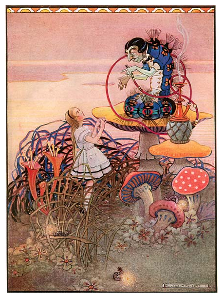
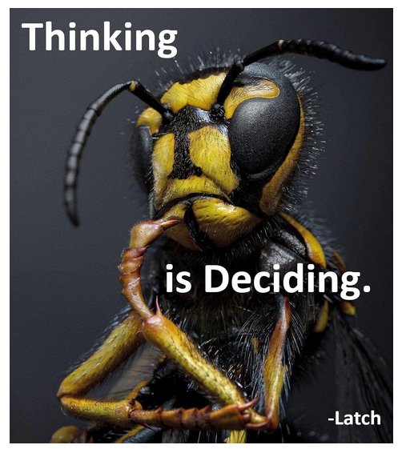
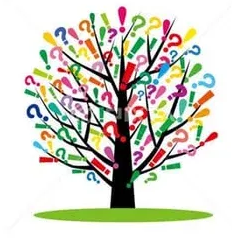

# Advice from a Caterpillar

In the book, the so called advice was nothing of the sort.

It was the presentation of a Decision.

> “One side will make you grow taller, and
>
> the other side will make you grow shorter.”
>
> --- The Caterpillar

The Decision is the answer to the question it first asked.

> "Who are you?”
>
> --- The Caterpillar

You don't see the world as it is, you see it as you are- As you see yourself.

Every action is reaction to your interaction with who you believe, think, feel yourself to be.

Although you can't change what you are, you can chance your response to yourself.

Responsibility is response ability.

It is your choice.

If you think yourself to be bad, your life will reflect that you are.

> "Thinking is Deciding”
>
> --- LordLatch

Your Thinking is Deciding how you will feel and how you feel becomes your experience.

Thinking is an equation. THIS=THAT

You make connections between things making them equal in some way.

The chair is red. Today is Tuesday. Beets are gross. I need to pee.

Like lightning bolts discharge the differential between sky and ground, thoughts bind things together.

Like magnetism around a wire, a field ( feeled ) is set up in direct reaction to every thought.

Bad thought, bad field ( feeling )

You cannot stop the feelings that result from thoughts and attempts to do so will make you sick.

You can, however, Decide how to respond the the resultant feelings with new thoughts.

If you respond to bad feelings with bad thoughts,

you will get more bad feelings ..ad infinitum.

> Thought: He hurt my feelings.
>
> Feeling: It felt bad.
>
> Decision: This always happens to me! \<repeat\>

Making a new Decision arrests the loop.

> Thought: He hurt my feelings.
>
> Feeling: It felt bad.
>
> Decision: I forgive.

Deeper within, we are forming the sense of self of who we think ourselves to be

with Decisions we may not be aware we're making.

> Thought: He hurt my feelings.
>
> Feeling: It felt bad.
>
> Decision: This always happens to me because I deserve it. I am a bad person. \<repeat\>

A recursive additive synthesis amplifies the problem:

> Thought: He hurt my feelings. I am a bad person.
>
> Feeling: It feels way bad.
>
> Decision: All people are bad. They're out to get me. I want to die. \<repeat\>

The expectation of receiving mistreatment permeates every aspect of our reality and we subconsciously set up fields of negative context and situations that coincide with who we think ourselves to be.

A Decision is a convergence of awareness upon some goal of what we'd like to experience or who we'd like to be. In fact, we are Deciding to be the person who receives what we want. We are the most alive when we don't know what to do. The onset of a Decision.

Awareness of being the Decider amplifies your power to Decide your reality.

You de-side each choice as you Decide. When pick one side to be your reality the other side is negated and the side you chose is now the whole. The branch becomes the trunk.

> "I am,
>
> The Decider.
>
> I, Decide."
>
> --- LordLatch

Where do we go from here?

Who are you?
