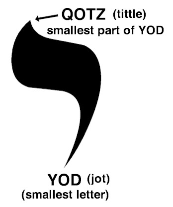

# Pig and Pepper

After everything leads to this point,

the story continues.

Pig and Pepper is about The Pause,

wherein Alice finds herself at a crossroads.

A comma in the middle of the sentence is a pivot where a Decision is made.

The Pause IS Now, the future follows.

When I write things like "I am, The Decider." I pronounce the comma, identifying myself as the comma like name or a title. It's a declaration of awareness as the captain of my own life. I am aware I author my own story as I pause in the midst, deciding what comes next in the sentence.

I am 'comma', The Decider.

I, 'comma', Decide.

{width="25%"}

I wield the full power of responsibility and bear the full responsibility of power.

I am, response able.

{width="40%"}

How do I Decide?

I'll give you a clue- WWJD?

That's right- listen to your Heart.

It is in direct alignment with Oneness and is how The Son speaks to you.

**I, Decide to Pause, and listen to my Heart.**

I retain free will and submit at the same time.

Did you know fate a free will are both valid?

Reality is a paradox.

Pair a docs. Parade OX.

Awareness grows when you allow for the possibility both sides of the argument are somehow true.

You might even start to see someone else's side of things and learn some empathy.
