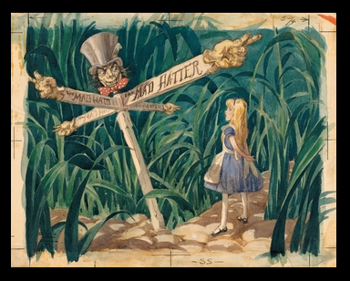

# Pig and Pepper

After everything leads to this point,

the story continues.

Pig and Pepper is about The Pause,

wherein Alice finds herself at a crossroads.

A comma in the middle of the sentence is a pivot where a Decision is made.

The Pause IS Now, the future follows.

When I write things like "I am, The Decider." I pronounce the comma, identifying myself as the comma like name or a title. It's a declaration of awareness as the captain of my own life. I am aware I author my own story as I pause in the midst, deciding what comes next in the sentence.

I am 'comma', The Decider.

I, 'comma', Decide.

I wield the full power of responsibility and bear the full responsibility of power.

I am, response able.

How do I Decide?
