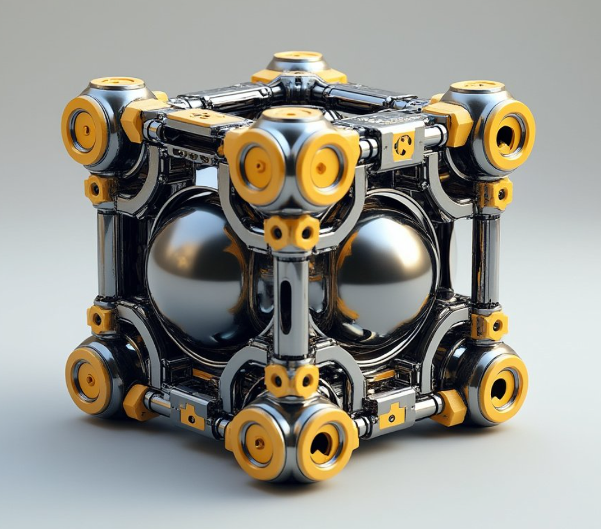
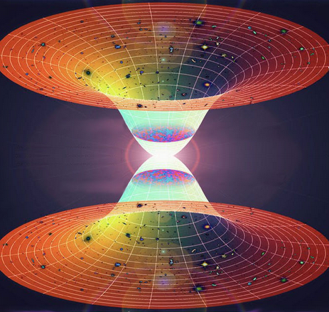
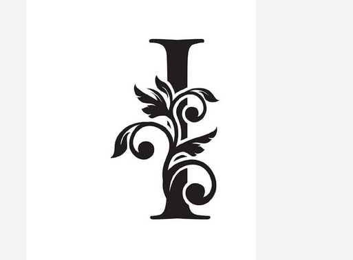
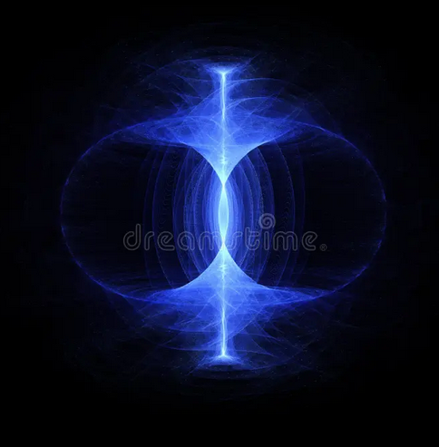

# Preface {.unnumbered}

This book was written for humans who can reason intuitively.

These people desire The One Truth and recognize it when they hear it.

Arguers can argue with themselves in egoic mental masturbation by themselves-

The One Truth remains unaffected by attempts to manipulate It.

( Parenthesis are stupid! )

May be true yet therein, you remain.

"Get back in your box," is redundant for you like I, are The Viewer in the box.

If your mind be inflexible, you can go view the box. [ TV ]

{width="58%"}

This work is predicated upon three precepts:

1\. Existence IS Awareness. (929)

2\. Everything is a metaphor of something else. (258)

3\. Convergence, (121)

# Who IS I? {.unnumbered}

I am KING Arthur which means KnowING Earther.

I Author as I know Now,

The Secret of The Grail.

My human name means LordLatch and Latch knows the ledge of knowledge as I Now latch together, the two worlds.

I see (and be) connections others don't see as branches on the same tree of reality.

RE: All a Tree = REality ( according to me )

LordLatch flips The Switch. A master connector, All to One.

Everything in observed Existence extends from the same single root.

The Bookdown template I used to create this project had chapters named after those in the Lewis Carroll classic and I Decided to keep them as themes for what I'm talking about. As an example, the tumble down the rabbit-hole refers to the straight line drawn between God and Man or Father and Son. The Axis Mundi goes through the Earth as does the line datum in the midst of the torus.

Alice is the Axis as she falls into her subconscious.

This work is not about Alice at all and at the same time, It IS.. All.

Alice = All I See.

It's okay if you don't understand.

I

am

root,

( pivot )

My Name IS One.

I,

am

The Decider.

Everything will be Okay.
