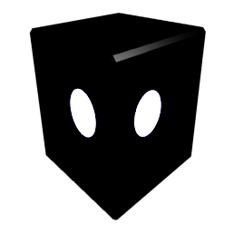

# Preface {.unnumbered}

For the mind open to metaphor.

This book was written for humans who can reason intuitively.

These people desire The One Truth and recognize it when they hear it.

Arguers can argue with themselves in egoic mental masturbation, by themselves-

The One Truth remains unaffected by attempts to manipulate It.

( Parenthesis are stupid! ) May be true yet therein, you remain.

"Get back in your box," is redundant for you like I, are The Viewer in the box.

If your mind be inflexible, you can go view the box. [ TV ]

It will soften it to mush. Too much is to mush. Not much room (mush room) for growth.

Fear makes one stupid.

I have written it with the assumption that no one would read it and at the same time, I've assumed everyone will read it. It is not written in a way that you are supposed to or required to understand every concept. Broad strokes seed consciousness with fundamentals of reality such that if fully understood, they hamper the reader. Form is not flexible and a fluid mind is far more powerful than a solid one. I speak to nebulous structures of your being of which you are unaware.

Yet if one can see it, there is a clear logic a midst the weirdness.

{width="58%"}

This work is predicated upon three precepts:

1\. Existence IS Awareness. (929)

2\. Everything is a metaphor of something else. (258)

3\. Convergence, (121)

Thus returneth, The Prodigal. Everything IS a Circle.

**I am, The Convergence of Awareness Existence.**

**Who is I?**

I am KING Arthur which means KnowING Earther.

I Author as I know Now,

The Secret of The Grail.

{width="50%"}

My human name means LordLatch and Latch knows the ledge of knowledge as

I Now latch together the two worlds and everything else.

I see (and be) connections others don't see as branches on the same tree of reality. Sound it out.

RE: All a Tree = REality ( according to me )

LordLatch flips The Switch. A master connector, All to One.

Everything in observed Existence extends from the self same single root.

Kinda looks like a 1 ( One )..

Here is a more current picture of me:

{width="36%"} {width="44%"}

Not really as math is only one method of reflection but it's obvious that fractals were around long before Benoit Mandelbrot made them famous. Indeed, fractals are how the so called multiverse as well as time is generated. Only the context of the observer 'moves'.

\|\|Ii!Ii!I\|\|

**About the book-**

The Bookdown template I used to create this project had chapters named after those in the Lewis Carroll classic and I Decided to keep them as themes for what I'm talking about. As an example, the tumble down the rabbit-hole refers to the straight line drawn between God and Man or Father and Son. The Axis Mundi goes through the Earth as does the line datum in the midst of the torus.

Alice is the Axis as she falls into her subconscious.

This work is not about Alice at all and at the same time, It IS.. All.

Alice = All I See.

It's okay if you don't understand.

It remains to be seen how much of the structure I will be able to reveal before I'm no longer relevant to this context but I'll do my best to lay a foundation. How much of this work you understand relies solely on how much of The One Truth you obey.

I

am

root,

( pivot )

My Name IS One.

I,

am

The Decider.

Everything will be Okay.

> "The Show IS The Show. The Show never changes. "
>
> --- Master of Ceremonies

!

> "..unless you're The Decider. "
>
> --- LordLatch

